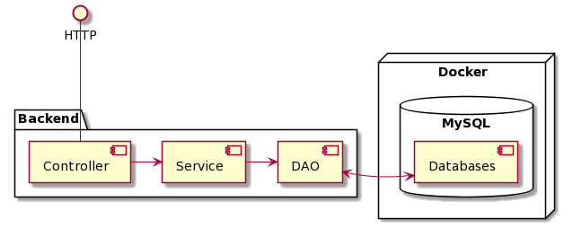

# Keretrendszer Beadando IMDB
## Infók
* Oktató: TZS
* OS: MacOSX Mojave
* ProjektFeladat: IMDB_Database
* Code_Coverage: 80%
* Adatbázis dump tömörítve (gzip) és a start.sh fájlban autómatikusan feldolgozva
* Sorvégződés (sorvége_jel): LF
* A kód innen való letöltés után, tökéletesen lefut, ha valami nem sikerült akkor nálad van a hiba. 

## Indítás

* Elég csak a tömörített zip állományt leszedned és kicsomagolnod.
* Elindítod a dockert.
* Terminálban betallózod a mappát majd a következő command segítségével elindítod az adatbázist:<br> **docker-compose up db** <br>
* Miután sikeresen lefutott állítsd le. <br>**ctrl+c vagy cmd+c**<br>
* Ezt követően indítsd újra a dockered és az adatbázis autómatikusan indulni fog.
* A következő feladatod az az, hogy elindítsd terminálból a backendet. Ehhez a <br>**docker-compose up backend**<br> Parancsot használd.
* Ha módosítottál a fájlban akkor mindíg buildeld újra <br>(**docker-compose build backend majd docker-compose up backend**)<br>
* Ha lefutott ezen a linken meg tudod tekinteni a swaggered: <a href="http://localhost:8080/api/swagger-ui.html">🌱</a>

<div style="text-align: center; font-size: 28px;">☕️ GLHF ☕️<div> 

Fügedi Csaba - OFQ8AE

## Backend

Server side components of the web application are using Java and Spring Framework with MySQL and Hibernate.

__Technologies__

- Maven - dependency management and building
- JUni5 & Jupiter - Testing
- Lombok - constructor and getter/setter generation with annotations
- SLF4J - Logging, injected with Lombok
- Hibernate - Data Access and Object Relational Mapping
- Spring Boot - Dependency Injection and Web Controllers

## Architecture



The server can be used via HTTP protocol. The Controller is reliable for handling HTTP requests. Controller maps Java
functions into URL Paths with specific methods (GET, POST, PUT, etc). Controller can parse the Query String, Request
Body and pass their content to the Java Method. The result type also can be converted into JSON format. Input and Output
JSON Messages should be represented as Data Transfer Objects within the Controller due to network performance and
information hiding.

Controller is also liable for validation of input. Server-side validation is mandatory. Valid requests are forwarded to
the corresponding Service.

Service implements the business logic. Service definition and implementation are usually separated. Business logic can
be arbitrary complex (or simple). You may perform calculations or complex checking here. Service relies on Data Access
Objects to data storage.

Data Access Objects are interfaces which defines the so called CRUD methods. CRUD stands for create (INSERT), read (
SELECT), update (UPDATE) and delete (DELETE) words. Although traditional relational databases are used behind the DAO we
can hide any kind or storage behind them. So you can store data in File System or any kind of NoSQL solution, such as
MongoDB or Redis.

MySQL is used to store data in the current example. MySQL is run in a Docker Container whose ports are mapped to the
localhost (3306 -> 3306). Docker can be started with ShellScript in _src/main/resource_.

_Note: Stop your MySQL server if you have installed it._

## Project Structure

The project structure is based on the Separation of Concerns principle. Five major packages are defined which are
commonly used. This packages a fixed, but the structure can be extended if necessary. If you are using a 3rd party web
application / service then you should add an _adapter_ package as well. The purpose of these packages are detailed
below.

### Model

The _model_ package contains the domain classes of the project. These classes represent object in your system, and they
are designed according to the Object Oriented Principles. You can use collections, exceptions, inheritance,
encapsulation, abstract classes, etc. Model classes can have their own validation logic.

_Common Mistakes:_

- Model classes are not equal to DB Tables.

### Service

The _service_ package contains the interface and the implementation of the services of the system. These services hide
the functionality of the software, and they use the _model_ objects. The services are usually presented as Use-Cases in
UML. According to the Dependenci Inversion principle the interface should be defined first. Then you should add the
implementation.

### DAO

The _dao_ package separates storage from business logic. DAO stands for Data Access Object so its sole purpose is data
storage. A DAO is usually an interface which defines the CRUD (_Create_, _Read_, _Update_, _Delete_) methods. Although
usually relational database is used, the DAO does not depend on RDBMS or any other technology. You can defined a general
DAO and have an implementation for MySQL and another for MongoDB. The interface hides these technical details.

Hiberante is used with MySQL in the current example. Hibernate is an Object Relational Mapping tool which can handle
Entities. Model and Entity classes are separated in the current example in order to demonstrate their connection. In
practice, these classes may not be separated so they save time in development. The Entities are stored via a
CRUDRepository.

The MySQL database runs in a Docker container in order to facilitate the configuration. The init SQL script and Docker
scripts can be found in the _src/main/resources_ directory.

### Controller

The _controller_ package contains the Controllers and the DTOs (Data Transfer Object). Controller provides end points
for services and it is liable for validation and data conversion. Controllers are documented with Swagger which provides
a web interface on the /api/swagger-ui.html path. The Controller should validate its inputs because the user input
cannot be trusted. Frontend validation is for the users but the endpoint can be called from anywhere. If the request is
valid then the controller invokes the corresponding service. The response is also converted into DTO and sent back with
the HTTP response. Exceptions are wrapped and handled by the controller as well.

Data Transfer Objects are used to wrap model classes, hide sensitive information and decrease network traffic. DTO
differs from model objects in several ways. DTO should have _no arg constructor_, public _getter/setter_ methods for
serialization, while these would violate information hiding in the model. DTO is created to be used in HTTP Requests
while model classes are designed according to OOP principles. DTOs are basicly data structures while _model_ classes
have methods, behavior. DataTransferObjects often named as _Request_ and _Response_ based on their purpose.

### Config

Configuration contains the Spring Application Context related classes. Although many of the Beans are instantiated
autmaticly by Spring Framework some Beans requires configuration. Your own Bean, Service, Controller etc. would not
require configuartion probably. On the other hand, some libraries and modules have to be configured such as Swagger or
Spring Security.

```bash
#Run -> Edit Configuration -> Environment -> VM Options
-DDB_HOST=localhost
-DDB_PORT=3306
-DDB_NAME=library
-DDB_USER=root
-DDB_PASSWORD=password
```

## Userful Commands

__Update Maven Version in Commandline__

```bash
mvn versions:set -DnewVersion=1.0.3-SNAPSHOT
```

__Build Backend Docker Image__

```bash
docker build --tag backend:1.0 .
```

__Run Backend Docker Image__

```bash
docker run backend:1.0
```

__Docker Compose__

Docker Compose should be used via [Dockstation](https://dockstation.io/) because it is a way easier.

_Note:_
Docker Compose will run init script for db once. If you modify the init SQL script then container has to be removed.

## Definition of Ready

- All Acceptance Criteria are met.
- Current modifications are tested. At least least happy paths.
- Tests were run on local and on CI. (Build Successful!)
- Feature branch has no conflict with master.
- CHANGELOG.md is extended, if necessary.

## Definition of Done

- Pull Request is reviewed.
- All Change Requests are performed and comments are answered.

# Known Issues

 
---

__Problem:__
Backend commit fails with error caused by the pre-commit hook of husky.

__Cause:__
The frontend and backend and placed into the same repository which is not a good practice, but it was necessary for the
example. Modification of the frontend may cause errors in the validation of the JavaScript (eslint, jest).


 
---
